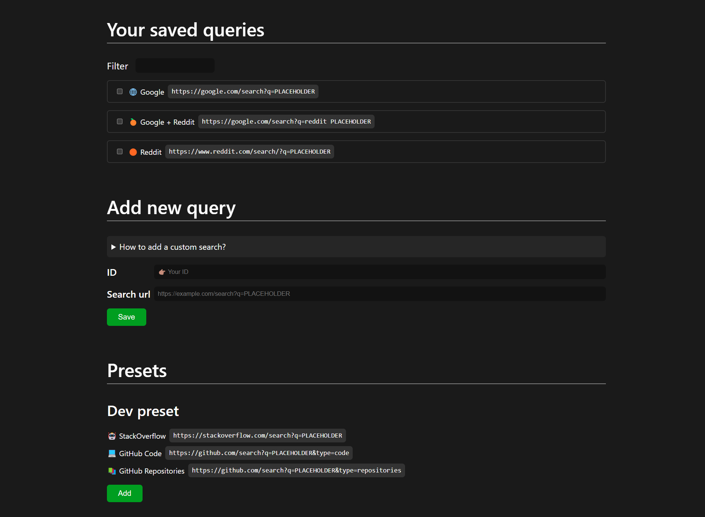

# Search in... - Chrome Extension

> Quickly search selected text on Google, Reddit, GitHub, or any custom site directly from browser's context menu.

This Chrome extension enhances your browsing experience by allowing you to **search selected text directly from the context menu**. Whether you're browsing casually or working on a project, this tool makes it easy to quickly search in the web.

It includes by default some searches to popular sites, such Google or Reddit. But you can also **create your own custom searches**. Whether you frequently search on niche websites or need access to specialized resources, you can add them.

Currently, it comes with a **developer focused preset**, set with quick links to popular programming resources, such us StackOverflow or Github. If you want to add more, feel free to open an [issue](https://github.com/victor-lillo/search-in-chrome-extension/issues).

Additionally, the extension allows you to **reorder the search options**. This feature makes it perfect for developers, researchers, or anyone who frequently searches across multiple platforms.

## Screenshots 📷

### Popup window

### Options page

